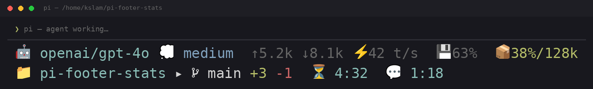

# pi-status-footer

A compact, zero-config two-line status footer for [pi](https://github.com/earendil-works/pi-coding-agent) — shows everything you want at a glance, fits on any terminal width.

## What it looks like



```
🤖 openai/gpt-4o 💭 medium  ↑5.2k ↓8.1k ⚡42 t/s  💾63%  📦38%/128k
📁 my-project ▸  main  +3 -1  ⏳ 4:32  💬 1:18
```

**Line 1 — Model & stats:** provider/model, thinking level with themed color, input/output tokens, tokens per second (live while streaming), cache hit rate, context window usage with color-coded fullness (green < 60%, yellow < 80%, red ≥ 80%).

**Line 2 — Project & timers:** repo folder name, git branch, live working-tree diff from HEAD (+N added lines, -M deleted), agent run timer (⏳), current turn timer (💬).

Everything auto-fits to your terminal width — lower-priority segments drop off when space is tight (model name is always shown, truncated if needed).

## Features

- **Zero config** — drop it in and it works
- **Live TPS** — shows tokens/second during generation, stays visible between turns
- **Git awareness** — asynchronous, debounced `git diff --shortstat HEAD` so typing never blocks; branch changes detected automatically via `footerData.onBranchChange`
- **Cache hit rate** — percentage of prompt tokens served from cache
- **Context gauge** — percentage and raw max; shifts from green → yellow → red as you approach the limit
- **Thinking level** — color-coded to match pi's thinking theme
- **Segments drop gracefully** — only the model name is mandatory; everything else fits to width
- **East Asian safe** — explicit ambiguous-width handling for CJK-friendly terminals
- **Safe at all times** — footer rendering never crashes the TUI, even on edge cases

## Installation

```bash
# Option 1: git (recommended, no npm account needed)
pi install git:github.com/kslamph/pi-status-footer@v1.0.0

# Option 2: npm
pi install npm:pi-status-footer

# Option 3: local directory
pi install /path/to/pi-status-footer
```

After installation, the footer appears automatically on the next pi TUI session. No configuration or activation needed.

## Display reference

### Line 1 — Model & stats

| Segment | Example | Source |
|---|---|---|
| 🤖 model | `🤖 openai/gpt-4o` | `ctx.model.provider / ctx.model.id` |
| 💭 thinking | `💭 high` | `ctx.thinkingLevel`, themed via `theme.fg()` |
| ↑input ↓output | `↑5.2k ↓8.1k` | Session `usage.input / usage.output` (accumulated across all entries) |
| ⚡tps | `⚡42 t/s` | Live during generation; last completed rate shown between turns |
| 💾cache | `💾63%` | `cacheRead / (input + cacheRead + cacheWrite)` |
| 📦context | `📦38%/128k` | `ctx.getContextUsage()`, color-coded by percent |

### Line 2 — Project & timers

| Segment | Example | Source |
|---|---|---|
| 📁 repo | `📁 my-project` | Git repo root basename (from `ctx.cwd` walk-up) |
| ▸  branch | `▸  main` | `footerData.getGitBranch()`, auto-updates |
| +N -M diff | `+3 -1` | Async `git diff --shortstat HEAD` (1s debounced) |
| ⏳ working | `⏳ 4:32` | Elapsed time since `agent_start`, HH:MM:SS above 1h |
| 💬 turn | `💬 1:18` | Elapsed time since last `turn_start` |

## How it works

The extension hooks into six pi lifecycle events:

- **`session_start`** — registers the footer via `ctx.ui.setFooter()`, discovers repo root, starts branch-change listener
- **`agent_start` / `agent_settled`** — controls the agent-run timer and a 1-second interval that triggers git diff refresh
- **`turn_start` / `turn_end`** — drives the per-turn timer
- **`message_start` / `message_update` / `message_end`** — tracks the generation window for live TPS
- **`model_select`** — clears stale TPS on model switch
- **`session_shutdown`** — cleans up all state

Git diff is fetched asynchronously via `execFile` with a 1-second debounce and `--no-optional-locks` to avoid contention. The render function caches the last result, so the footer stays responsive regardless of repo size.

## Requirements

- pi coding agent (any recent version with `ctx.ui.setFooter` and `footerData` support)
- git available on `PATH` for git diff and branch features (optional — footer degrades gracefully without it)

## Development

The extension is a single TypeScript file (`stats-footer.ts`) that pi loads via [jiti](https://github.com/unjs/jiti). There is no build step.

TypeScript types are provided by the pi runtime packages:

```bash
# Install peer dependencies for type checking (optional)
npm install --save-dev @earendil-works/pi-ai @earendil-works/pi-coding-agent @earendil-works/pi-tui
npx tsc --noEmit stats-footer.ts
```

## Releasing to npm

A GitHub Action (`.github/workflows/release.yml`) auto-publishes to npm via trusted publishing (OIDC) on tag push.

1. Bump the version in `package.json` and commit on `main`.
2. Tag the commit — the tag must match the version, e.g. `v1.0.1`:

   ```bash
   git tag v1.0.1
   git push origin v1.0.1
   ```

3. The workflow verifies the tag/version match, dry-runs `npm pack`, then publishes with [npm provenance](https://docs.npmjs.com/generating-provenance-statements).

### One-time setup

Before the first tag push, bind the GitHub Actions workflow as a trusted publisher. You must be logged into npm:

```bash
npm adduser                            # if not already logged in (2FA required)
npm publish --access public             # first publish — creates the package on npm
npm trust github pi-status-footer \
  --repo kslamph/pi-status-footer \
  --file release.yml -y
```

This claims the `pi-status-footer` package name, publishes v1.0.0, and authorises the `release.yml` workflow to publish via OIDC without any token. After this one-time setup, just push a `vX.Y.Z` tag and the action takes over.

### Pre-release versions

Tags like `v1.0.1-beta.1` publish to the `next` dist-tag instead of `latest`.

## License

MIT — see [LICENSE](./LICENSE).