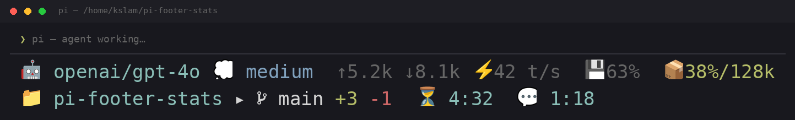

# pi-status-footer

A compact, zero-config two-line status footer for [pi](https://github.com/earendil-works/pi-coding-agent) — shows everything you want at a glance, fits on any terminal width.

## What it looks like



```
📦 38%/128k  💾 63%  ↑5.2k ↓8.1k  💰 $0.420 +$0.020000  ⚡42 t/s  ⏳ 4:32  💬 1:18
📁 my-project ▸  main +3 -1  🤖 openai/ry-very-long-modelid-4o 💭 medium
```

**Line 1 — Stats & timers:** context window usage with color-coded fullness (green < 60%, yellow < 80%, red ≥ 80%), cache hit rate, input/output tokens, session cost with the current run's cost (💰), tokens per second (live while streaming), agent run timer (⏳), current turn timer (💬).

**Line 2 — Project & model:** repo folder name, git branch, live working-tree diff from HEAD (+N added lines, -M deleted), provider/model, thinking level with themed color.

Everything auto-fits to your terminal width. Line 1 always keeps every segment (it clips only on very narrow terminals). On line 2 the model is mandatory: the model id is shortened from the left, keeping the provider and thinking level intact — only if even that can't fit does the folder/git group drop off.

## Features

- **Zero config** — drop it in and it works
- **Live TPS** — shows tokens/second during generation, stays visible between turns
- **Git awareness** — asynchronous, debounced `git diff --shortstat HEAD` so typing never blocks; branch changes detected automatically via `footerData.onBranchChange`
- **Cache hit rate** — percentage of prompt tokens served from cache
- **Cost, sum + delta** — session total with the current agent run's cost alongside it, at fixed precision (sum 3 decimals, delta 6) so the segment width never changes and no value is abbreviated into scientific notation; a fresh session shows a `$0.000` placeholder and models with no catalog pricing read `n/a` instead of a misleading `$0.00`
- **Context gauge** — percentage and raw max; shifts from green → yellow → red as you approach the limit
- **Thinking level** — color-coded to match pi's thinking theme
- **Responsive model id** — shortened from the left (with an `…` marker) when space is tight, so the provider and thinking level stay fully readable; the folder/git group drops only when the model still can't share the line
- **Line 1 never drops stats** — every stat segment always renders; on very narrow terminals the line clips instead
- **East Asian safe** — explicit ambiguous-width handling for CJK-friendly terminals
- **Safe at all times** — footer rendering never crashes the TUI, even on edge cases

## Installation

```bash
# Option 1: git (recommended, no npm account needed)
pi install git:github.com/kslamph/pi-status-footer@v1.0.0

# Option 2: npm
pi install npm:pi-status-footer

# Option 3: local directory
pi install /path/to/pi-status-footer
```

After installation, the footer appears automatically on the next pi TUI session. No configuration or activation needed.

## Display reference

### Line 1 — Stats, cost & timers

| Segment | Example | Source |
|---|---|---|
| 📦context | `📦 38%/128k` | `ctx.getContextUsage()`, color-coded by percent |
| 💾cache | `💾 63%` | `cacheRead / (input + cacheRead + cacheWrite)` |
| ↑input ↓output | `↑5.2k ↓8.1k` | Session `usage.input / usage.output` (accumulated across all entries) |
| 💰 cost | `💰 $0.420 +$0.020000` | Session sum of `usage.cost.total`, plus the current agent run's cost |
| ⚡tps | `⚡42 t/s` | Live during generation; last completed rate shown between turns |
| ⏳ working | `⏳ 4:32` | Elapsed time since `agent_start`, HH:MM:SS above 1h |
| 💬 turn | `💬 1:18` | Elapsed time since last `turn_start` |

Cost notes: the sum accumulates every usage-bearing entry (assistant messages, tool results, compaction, branch summaries) and survives a session resume, since pi persists per-message cost in the session file. The delta is the session cost sampled at `agent_start` subtracted from the current total, so it covers the same window as the ⏳ run timer and freezes when the run settles. It is deliberately **not** sampled per turn: in pi a "turn" is one assistant message inside the agentic tool loop, so a per-turn baseline was rewritten after every message and the delta flashed at `message_end` and was gone again before the next message finished streaming. The sum is rounded to 3 decimals and the delta to 6 — fixed precision, so the segment width is stable and nothing is ever rendered in scientific notation; a rate that is wrong by 1e6 shows as `$0.000`, which is visibly broken on purpose. A model that declares no catalog pricing (aggregator providers) reports zero cost and renders `n/a`; before any usage the segment renders a `$0.000` placeholder so it is present from the first frame.

### Line 2 — Project & model

| Segment | Example | Source |
|---|---|---|
| 📁 repo | `📁 my-project` | Git repo root basename (from `ctx.cwd` walk-up) |
| ▸  branch | `▸  main` | `footerData.getGitBranch()`, auto-updates |
| +N -M diff | `+3 -1` | Async `git diff --shortstat HEAD` (1s debounced) |
| 🤖 model | `🤖 openai/gpt-4o` | `ctx.model.provider / ctx.model.id`, id shortened from the left when narrow |
| 💭 thinking | `💭 high` | `ctx.thinkingLevel`, themed via `theme.fg()` |

## How it works

The extension hooks into six pi lifecycle events:

- **`session_start`** — registers the footer via `ctx.ui.setFooter()`, discovers repo root, starts branch-change listener
- **`agent_start` / `agent_settled`** — controls the agent-run timer and a 1-second interval that triggers git diff refresh; also samples the session cost at `agent_start` as the baseline for the run's cost delta
- **`turn_start` / `turn_end`** — drives the per-turn timer. It deliberately does *not* touch the cost baseline: see the cost notes above.
- **`message_start` / `message_update` / `message_end`** — tracks the generation window for live TPS. Most providers only report output-token usage at message end, so `message_update` estimates tokens live from the streamed delta characters (text/thinking/toolcall), calibrated against each message's real usage at `message_end`
- **`model_select`** — clears stale TPS on model switch
- **`session_shutdown`** — cleans up all state

Git diff is fetched asynchronously via `execFile` with a 1-second debounce and `--no-optional-locks` to avoid contention. The render function caches the last result, so the footer stays responsive regardless of repo size.

## Requirements

- pi coding agent (any recent version with `ctx.ui.setFooter` and `footerData` support)
- git available on `PATH` for git diff and branch features (optional — footer degrades gracefully without it)

## Development

The extension is a single TypeScript file (`stats-footer.ts`) that pi loads via [jiti](https://github.com/unjs/jiti). There is no build step.

TypeScript types are provided by the pi runtime packages:

```bash
# Install peer dependencies for type checking (optional)
npm install --save-dev @earendil-works/pi-ai @earendil-works/pi-coding-agent @earendil-works/pi-tui
npx tsc --noEmit stats-footer.ts
```

## License

MIT — see [LICENSE](./LICENSE).